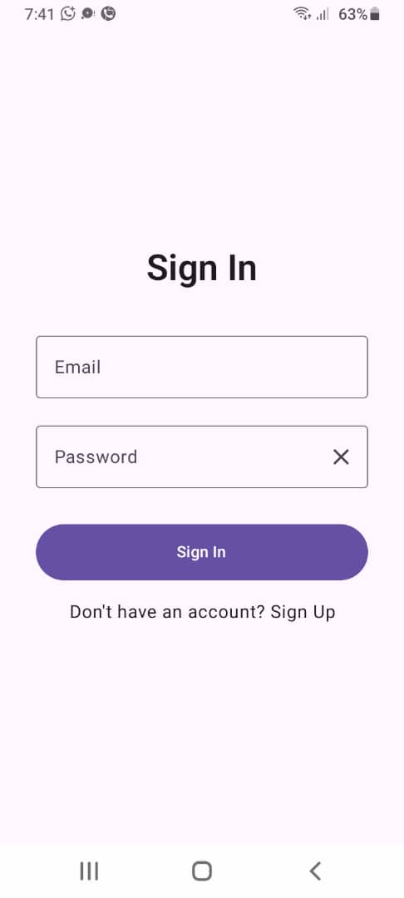
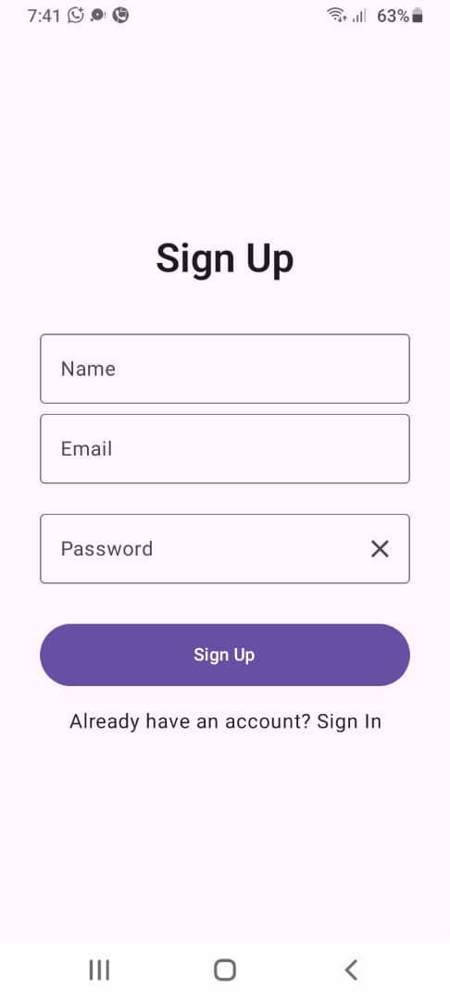
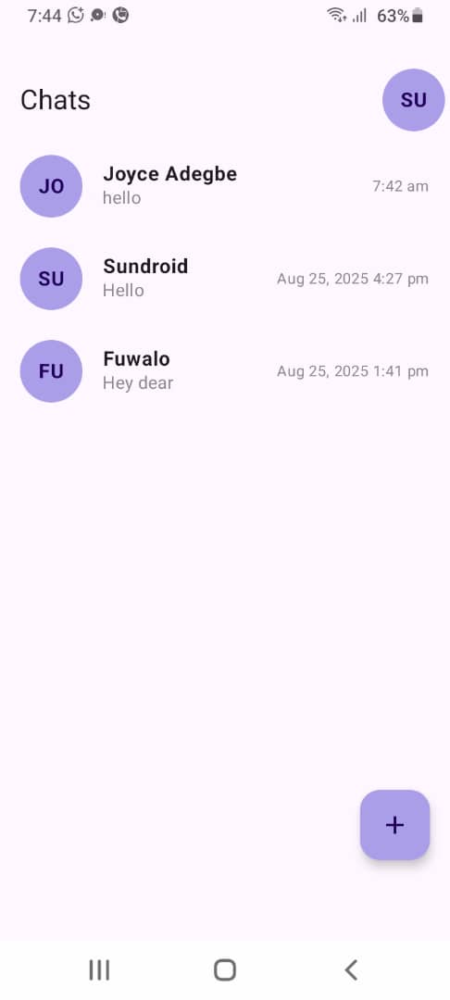
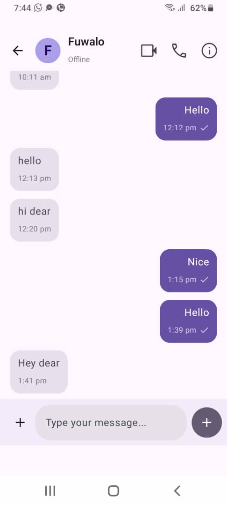
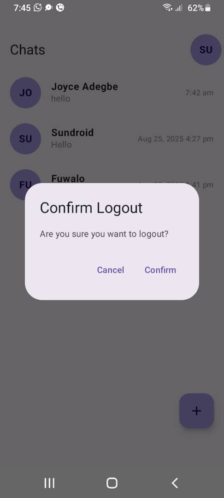

## Project Description
Assessment test for the role of a Senior Android Developer at Aspacelife Technology
## Details
I focused more on implementing the core features of the application (Authentication and Real-Time chat).
I implemented User Sign In, Sign Up, Initiate Conversation, Read Conversation, Send and Recieve Messages including cache (Room Database).
## What I would have added given more time
Given more time, I would have added read receipt and implemented the extra features such as media upload.

## Screenshots

